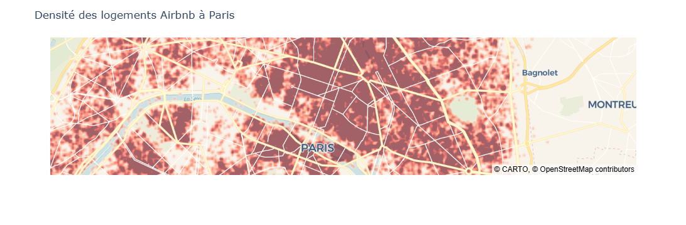
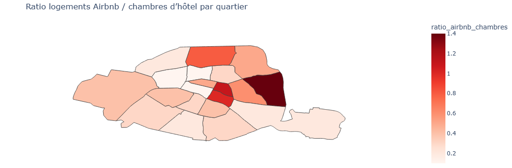

# Analyse de la concurrence Airbnb à Paris

## Contexte

Ce projet propose une analyse de la concurrence entre les logements Airbnb et l’offre hôtelière à Paris, à partir de données ouvertes.
L’objectif est de comprendre comment l’implantation d’Airbnb varie selon les quartiers et d’identifier les segments de l’hôtellerie les plus exposés.

---

## Objectifs

* Estimer le revenu minimal des logements Airbnb
* Analyser la répartition spatiale des logements
* Étudier la structure de l’offre hôtelière
* Comparer l’offre Airbnb à la capacité hôtelière
* Identifier les zones de forte concurrence

---

## Données

* `airbnb_paris.csv` : caractéristiques des logements Airbnb
* `hotels_paris.csv` : informations sur les hôtels (localisation, étoiles, capacité)
* `paris.geojson` : géométrie des quartiers de Paris

---

## Méthodologie

* Nettoyage et préparation des données
* Construction d’indicateurs (durée minimale, revenu estimé)
* Analyse exploratoire
* Analyse spatiale (cartes choroplèthes)
* Construction d’un indicateur clé :
  ratio logements Airbnb / chambres d’hôtel

---

## Résultats

* Les quartiers centraux concentrent une forte présence de logements Airbnb
* La concurrence varie fortement selon les quartiers
* Les hôtels haut de gamme apparaissent moins directement affectés
* Les établissements intermédiaires (2* et 3*) semblent plus exposés

---

## Visualisations

* Carte du revenu estimé
* Carte de densité des logements Airbnb
  
* Répartition des hôtels par catégorie
* Carte du ratio Airbnb / capacité hôtelière
  
* Analyse croisée hôtels / concurrence

---

## Limites

* Le revenu estimé reste un indicateur brut
* Le nombre d’avis est utilisé comme approximation de l’activité
* Certaines données peuvent comporter des biais

---

## Conclusion

L’analyse met en évidence une concurrence hétérogène entre Airbnb et l’hôtellerie à Paris.
Si certains quartiers sont fortement marqués par la présence d’Airbnb, les hôtels haut de gamme conservent une position relativement stable, tandis que les segments intermédiaires apparaissent plus vulnérables.

---

## Technologies

Python, Pandas, GeoPandas, Plotly, Matplotlib
